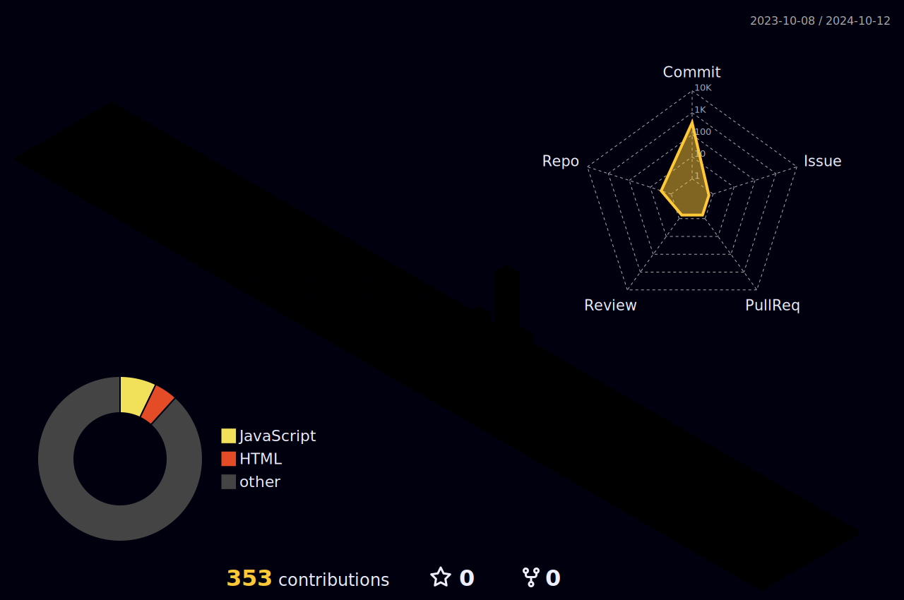

<!-- Header -->

<!-- About Section -->
# 👋 About me

 
  
 😉 &emsp; I am Hyun-Jin Kim, AI Engineer with passion.  
 ❤️ &emsp; Love to writing code and learning new technologies.  
 📧 &emsp; Reach me anytime: khj05592002@naver.com  
 💬 &emsp; Read my blog: [jjinhub's Blog](https://jjinhub.github.io)

  

# 💻 Skills

  

# 🔨 Tools

  

# ✏ Blog

  

# 🏆 Ranking

  

# 🛠️ Github Stats

  

  
  
   

