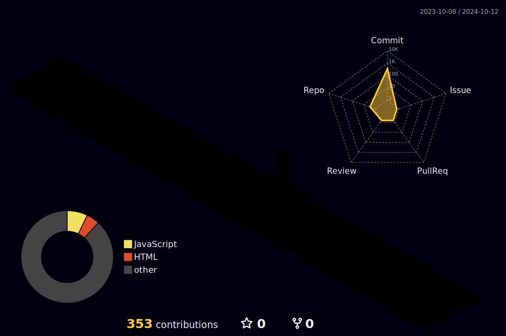

<!-- 방문자 수 -->
<a href="https://hits.seeyoufarm.com">
  
</a>

<!-- WakaTime -->
[](https://wakatime.com/@73943fcf-f7e6-450f-8589-a6c2a6347733)

<!-- Header -->

[](https://git.io/typing-svg)
<hr/>

<!-- About Section -->
# 👋 About me
<p>
 
  
 😉 &emsp; I am Hyun-Jin Kim, a developer with a passion for FE Development.<br/><br/>
 ❤️ &emsp; Love to writing code and learning new technologies.<br/><br/>
 📧 &emsp; Reach me anytime: khj05592002@naver.com<br/><br/>
 💬 &emsp; Read my blog: [jjinhub's Blog](https://jjinhub.github.io)
</p>

<br/><br/>

# 💻 Skills
### Frontend


<br/><br/>

### Backend


<br/><br/>

### Database


<br/><br/>

### Tools

<br/><br/>

### Version Control

<br/><br/>

# ✏ Blog


<br/><br/>

# 🏆 Ranking
[](https://www.acmicpc.net/user/khj05592002)
<br/><br/>

# ⏰ Work Stats
<!--START_SECTION:waka-->
**I'm a Night 🦉** 

```text
🌞 Morning                13 commits          █░░░░░░░░░░░░░░░░░░░░░░░░   04.64 % 
🌆 Daytime                62 commits          ██████░░░░░░░░░░░░░░░░░░░   22.14 % 
🌃 Evening                37 commits          ███░░░░░░░░░░░░░░░░░░░░░░   13.21 % 
🌙 Night                  168 commits         ███████████████░░░░░░░░░░   60.00 % 
```
📅 **I'm Most Productive on Monday** 

```text
Monday                   142 commits         █████████████░░░░░░░░░░░░   50.71 % 
Tuesday                  54 commits          █████░░░░░░░░░░░░░░░░░░░░   19.29 % 
Wednesday                14 commits          █░░░░░░░░░░░░░░░░░░░░░░░░   05.00 % 
Thursday                 18 commits          ██░░░░░░░░░░░░░░░░░░░░░░░   06.43 % 
Friday                   16 commits          █░░░░░░░░░░░░░░░░░░░░░░░░   05.71 % 
Saturday                 23 commits          ██░░░░░░░░░░░░░░░░░░░░░░░   08.21 % 
Sunday                   13 commits          █░░░░░░░░░░░░░░░░░░░░░░░░   04.64 % 
```


📊 **This Week I Spent My Time On** 

```text
🕑︎ Time Zone: Asia/Seoul

💬 Programming Languages: 
No Activity Tracked This Week

🔥 Editors: 
No Activity Tracked This Week

💻 Operating System: 
No Activity Tracked This Week
```


<!--END_SECTION:waka-->

# 🛠️ Github Stats
<p align="center">
  
</p>

<p href="https://github.com/jjinhub" align="center">
  
  
  <br/>
</p>




<!--
**jjinhub/jjinhub** is a ✨ _special_ ✨ repository because its `README.md` (this file) appears on your GitHub profile.

Here are some ideas to get you started:

- 🔭 I’m currently working on ...
- 🌱 I’m currently learning ...
- 👯 I’m looking to collaborate on ...
- 🤔 I’m looking for help with ...
- 💬 Ask me about ...
- 📫 How to reach me: ...
- 😄 Pronouns: ...
- ⚡ Fun fact: ...
-->
